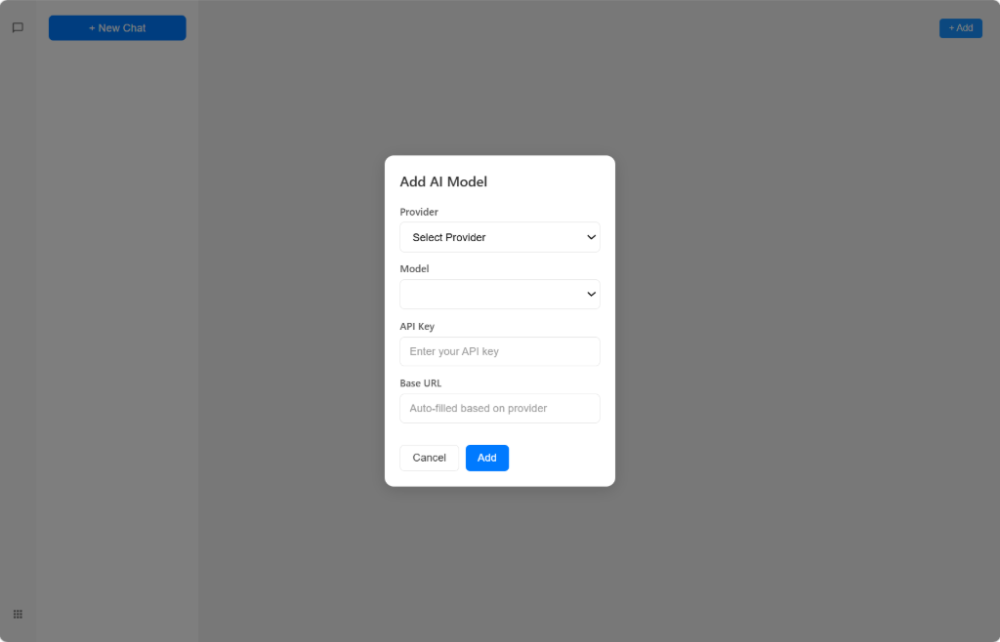
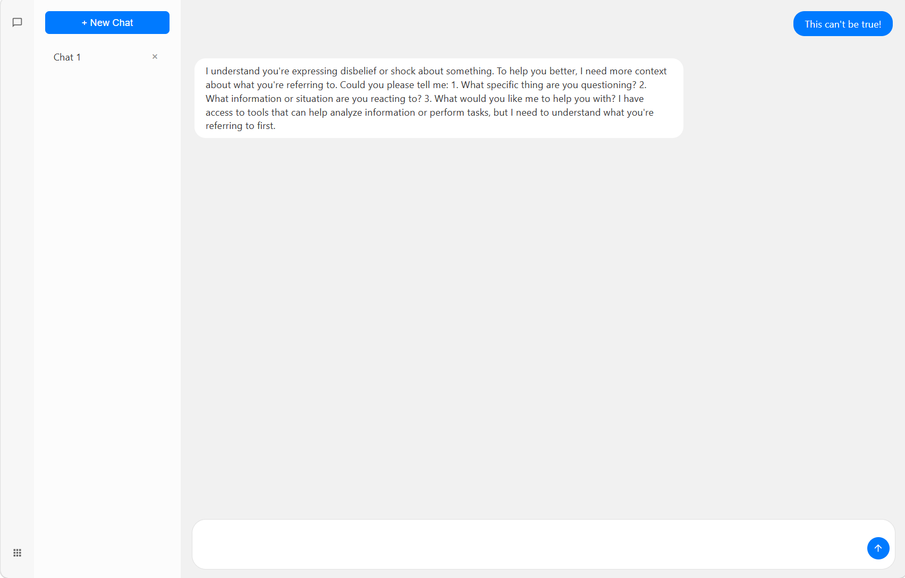

<p align="center">
  
</p>

<h1 align="center">AITOS</h1>

<p align="center">
  AI Agent 执行运行时 — 让 AI 直接操作计算机，而不仅仅是返回文本。
</p>

<p align="center">
  <a href="https://www.npmjs.com/package/aitos"></a>
  
</p>

---

## AITOS 是什么？

AITOS 提供了 **108 个原子**（最小操作单元），AI 可以将它们组合成 **图**（程序），运行时直接执行这些图。把它想象成 **AI 的指令集** —— 就像 x86 是 CPU 的指令集，AITOS 是 AI Agent 的指令集。

### 与 Function Calling / LangChain 的区别

| | Function Calling / LangChain | AITOS |
|---|---|---|
| **AI 输出** | JSON（调用预定义函数） | Graph（AI 自己生成的程序） |
| **执行方式** | 一次调用一个 | 图引擎执行完整程序 |
| **AI 能操作什么** | 你定义的 API | DOM、Canvas、文件系统、传感器... |
| **AI 能力** | 调用你预设的函数 | 组合原子创造新功能 |
| **格式** | JSON Schema | ACS（紧凑语法，比 JSON 小 5-10 倍） |

## 30 秒演示

```typescript
import { AitosRuntime, compileAcs, allAtoms } from 'aitos'

const runtime = new AitosRuntime()
allAtoms.forEach(a => runtime.register(a))

// AI 生成这个图 —— 使用 ACS 紧凑语法
const graph = compileAcs(`
  graph hello {
    let createDiv = createElement(tag: "div", id: "hello")
    let setText = setTextContent(id: "hello", text: "Hello from AI!")
    let setColor = setStyles(id: "hello", styles: { color: "blue", fontSize: "24px" })
    let append = appendChild(parentId: "app", childId: "hello")
  }
`)

await runtime.executeGraph(graph, context)
// → 页面上出现蓝色的 "Hello from AI!"
```

AI 不需要 React 组件、JSX 或构建工具 —— 它只需要将原子组合成图，运行时执行它。

## 演示应用

**[LinkArm](./linkarm)** — 一个功能完整的 AI 聊天应用，完全用 AITOS 原子构建。没有 React、没有 Vue、没有组件框架。每个 UI 元素都由原子创建：`createElement`、`setStyles`、`appendChild`、`setTextContent`。

<p align="center">
  
  
</p>

## 快速开始

**前置条件**：Node.js 18+

```bash
# 1. 克隆仓库
git clone https://github.com/your-username/aitos.git
cd aitos

# 2. 构建核心包
cd aitos && npm install && npm run build && cd ..

# 3. 运行演示应用
cd linkarm && npm install && npm run dev
```

在浏览器中打开 http://localhost:5173。

**你将看到**：LinkArm —— 一个完全用 AITOS 原子构建的 AI 聊天应用。添加你的 AI 模型（OpenAI 兼容 API）即可开始聊天。

## 核心概念

### Atom（原子）—— 最小操作单元

每个原子只做一件事。AI 可以调用任何原子，或将多个原子组合成图。

```typescript
interface Atom {
  name: string;           // 例如 "createElement", "add", "httpRequest"
  version: string;
  meta: {
    input: Array<{ name: string; type: string; description?: string }>;
    output: { type: string; description?: string };
  };
  execute: (input: any, context: Context) => Promise<Result>;
}
```

### Graph（图）—— AI 生成的程序

图定义了使用原子的执行流程。AI 生成图，运行时执行它们。

**ACS 语法**（紧凑、AI 友好）：

```
graph chat {
  let getUserInput = getValue(id: "inputBox")
  if getUserInput {
    let callAI = httpStreamRequest(url: "{{apiUrl}}", body: "{{getUserInput}}")
    let showResponse = setTextContent(id: "output", text: "{{callAI.content}}")
  }
}
```

等效的 JSON（大 5-10 倍）：

```json
{
  "order": ["getUserInput", "branch"],
  "nodes": {
    "getUserInput": { "atom": "getValue", "id": "inputBox" },
    "branch": {
      "atom": "branch",
      "cond": "{{getUserInput}}",
      "then": {
        "order": ["callAI", "showResponse"],
        "nodes": {
          "callAI": { "atom": "httpStreamRequest", "url": "{{apiUrl}}", "body": "{{getUserInput}}" },
          "showResponse": { "atom": "setTextContent", "id": "output", "text": "{{callAI.content}}" }
        }
      }
    }
  }
}
```

使用 `{{nodeId}}` 或 `{{nodeId.field}}` 引用另一个节点的输出。

## 内置原子（108 个）

### 核心（50 个原子）

| 类别 | 原子 |
|----------|-------|
| **状态** | `get`, `set` |
| **计算** | `add`, `sub`, `mul`, `div`, `mod`, `random` |
| **判断** | `eq`, `gt`, `lt`, `gte`, `lte`, `and`, `or`, `not`, `isNil`, `isNum`, `isStr`, `isArr`, `isObj` |
| **控制** | `branch`, `loop`, `forEach`, `exec`, `execGraph`, `execFile`, `wait`, `log`, `getSkillSet` |
| **操作** | `concat`, `split`, `len`, `push`, `pop`, `slice`, `getProp`, `setProp`, `keys`, `values`, `merge`, `filter`, `format` |
| **时间** | `timestampToDate`, `getMonthDays`, `isLeapYear` |
| **工具调用** | `handleToolCalls`, `listTools`, `registerTool`, `executeTool` |

### 扩展包

| 包 | 原子数 | 描述 |
|---------|-------|-------------|
| **@aitos/output** | 38 | DOM 操作、Canvas 2D、通知 |
| **@aitos/input** | 7 | 鼠标、触摸、键盘、文件选择 |
| **@aitos/store** | 6 | localStorage、图管理 |
| **@aitos/transfer** | 2 | HTTP 请求、SSE 流 |
| **@aitos/sense** | 5 | 加速度计、陀螺仪、地理位置、电池、网络 |

## 架构

```
┌─────────────────────────────────────────┐
│             应用层                      │
│  ┌─────────────────────────────────┐   │
│  │       Graph (ACS / JSON)        │   │
│  │  ┌─────┐     ┌─────┐           │   │
│  │  │Atom1│────→│Atom2│────→ ...  │   │
│  │  └─────┘     └─────┘           │   │
│  └─────────────────────────────────┘   │
├─────────────────────────────────────────┤
│           AITOS 运行时                  │
│  ┌──────────┐  ┌──────────────────┐    │
│  │ ACS      │  │ Graph 执行器     │    │
│  │ 解析器   │  │ + 验证器         │    │
│  │ 编译器   │  │ + 引用解析       │    │
│  └──────────┘  └──────────────────┘    │
├─────────────────────────────────────────┤
│  核心 (50)   │  扩展包                  │
│  - state     │  - @aitos/input (7)     │
│  - control   │  - @aitos/output (38)   │
│  - judgment  │  - @aitos/store (6)     │
│  - calc      │  - @aitos/transfer (2)  │
│  - manip     │  - @aitos/sense (5)     │
│  - time      │                          │
│  - toolcalls │                          │
└─────────────────────────────────────────┘
```

## AI 集成

AITOS 设计为与任何支持 Function Calling 的 LLM 配合使用：

1. **`getSkillSet`** — 返回所有可用原子的 JSON 描述。将其作为工具提供给 AI。
2. **`handleToolCalls`** — 处理 AI 的 tool_calls 响应，执行请求的原子。
3. **`execGraph`** — AI 可以生成并执行完整的图，而不仅仅是单个函数调用。

示例流程：
```
用户 → AI → getSkillSet() → [AI 看到所有原子]
用户 → AI → AI 生成图 → execGraph(graph) → 结果
```

## 使用场景

- **操作 UI 的 AI Agent** — AI 直接创建和操作 DOM 元素
- **AI 桌面助手** — AI 控制窗口、读取文件、执行命令
- **AI 驱动的应用** — AI 可以在运行时修改逻辑的应用
- **快速原型开发** — 用原子构建功能性 UI，无需框架

## 许可证

MIT
